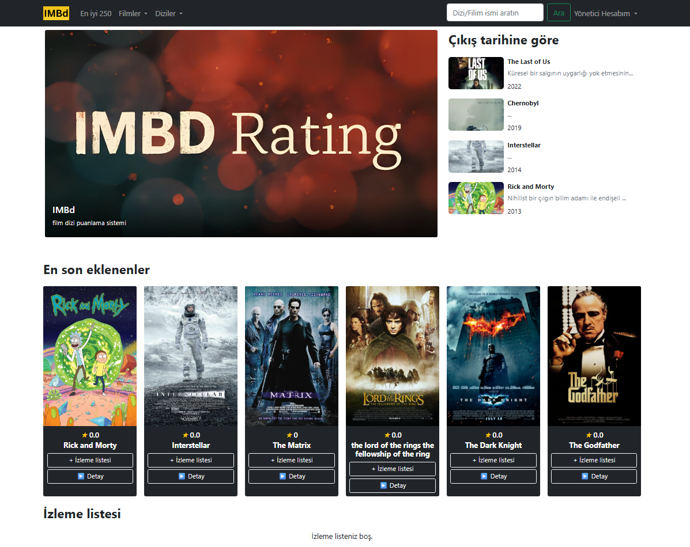

IMBD (IMDB Clone)
=================

Bu proje, **IMDB benzeri bir film-dizi arşiv sitesi** olarak geliştirildi.  
Tamamen bireysel olarak geliştirilmiş olup, **PHP, MySQL, HTML, CSS, Bootstrap** ve hazır tema entegrasyonu kullanılmıştır.  

 <!-- Buraya projenin ekran görüntüsünü ekleyebilirsin -->

---

## Özellikler
- Film ve dizi listesi görüntüleme  
- Detay sayfaları (film açıklaması, türü, IMBD puanı vb.)  
- Film arama özelliği  
- Kullanıcı girişi  
- Yönetim paneli üzerinden film/dizi ekleme  

---

## Kullanılan Teknolojiler
- **PHP** (Backend geliştirme)  
- **MySQL** (Veritabanı yönetimi)  
- **HTML5 & CSS3** (Frontend)  
- **Bootstrap** (Responsive tasarım)  
- **XAMPP** (Geliştirme ortamı)  
- Hazır tema entegrasyonu  

---

## Kurulum
Projeyi kendi bilgisayarınızda çalıştırmak için:

#### Gereksinimler
- [XAMPP](https://www.apachefriends.org/) veya benzeri bir PHP sunucusu  

#### Adımlar
1. Bu projeyi indirip `htdocs` klasörüne atın:  
C:\xampp\htdocs\imbd

Eğer projeyi başka bir dizine taşımayı düşünüyorsanız—örneğin: C:\xampp\htdocs\projeler\  
bu durumda, proje içinde yer alan app/core/config.php dosyasındaki ROOT sabitini yeni konuma göre güncellemeniz gerekir. 
Aksi takdirde proje düzgün çalışmayabilir.  

‘ROOT', 'http://localhost/IMBd/public' => ‘ROOT', 'http://localhost/projeler/IMBd/public' 

2. XAMPP üzerinden **Apache** ve **MySQL**’i başlatın.    

3. Tarayıcınızda şu adrese gidin:  
http://localhost/imbd/public/

Yönetici hesabı: Email= admin@IMBd.com , Parola= adminadmin  
Kullanıcı hesabı: Email= kullanici@gmail.com, Parola= kullanıcı 

---

## Geliştirici
Bu proje tamamen bireysel olarak geliştirilmiştir. 👨‍💻  

- **Geliştirici:** Leachyphey  
